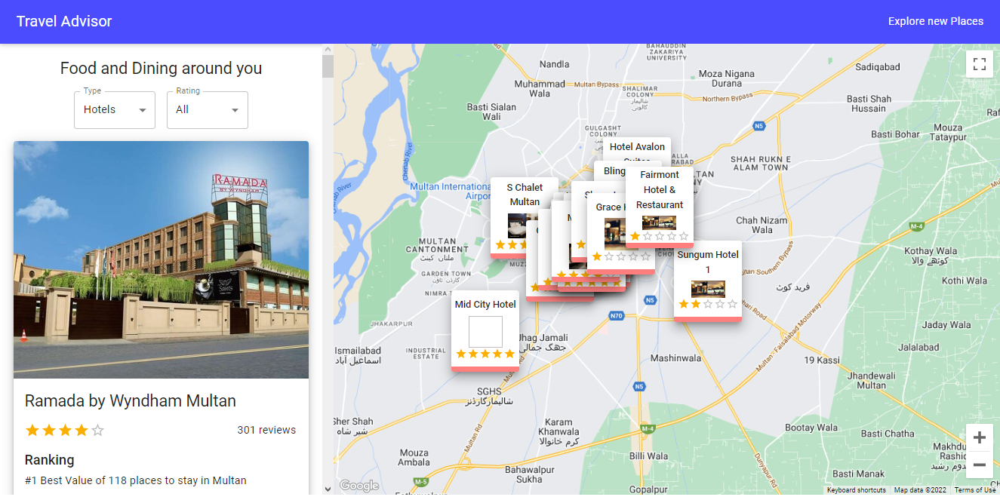

# Find Places
I developed the Find Places app using Google Maps and some APIs. It will suggest you all the restaurants, hotels and attractions around you. 
 
[Live Site](https://find-places-and-restruants.netlify.app)

## Developed with 
- React (States, Hooks)
- Material UI
- Axios
- Google Maps

API used: Travel Advisor API (Rapid Api)

## How to Start
In the project directory, you can run:
### `npm start`

Runs the app in the development mode.\
Open [http://localhost:3000](http://localhost:3000) to view it in your browser.
